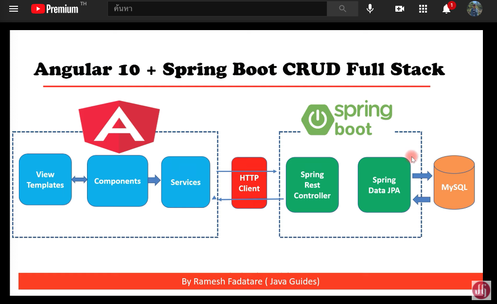
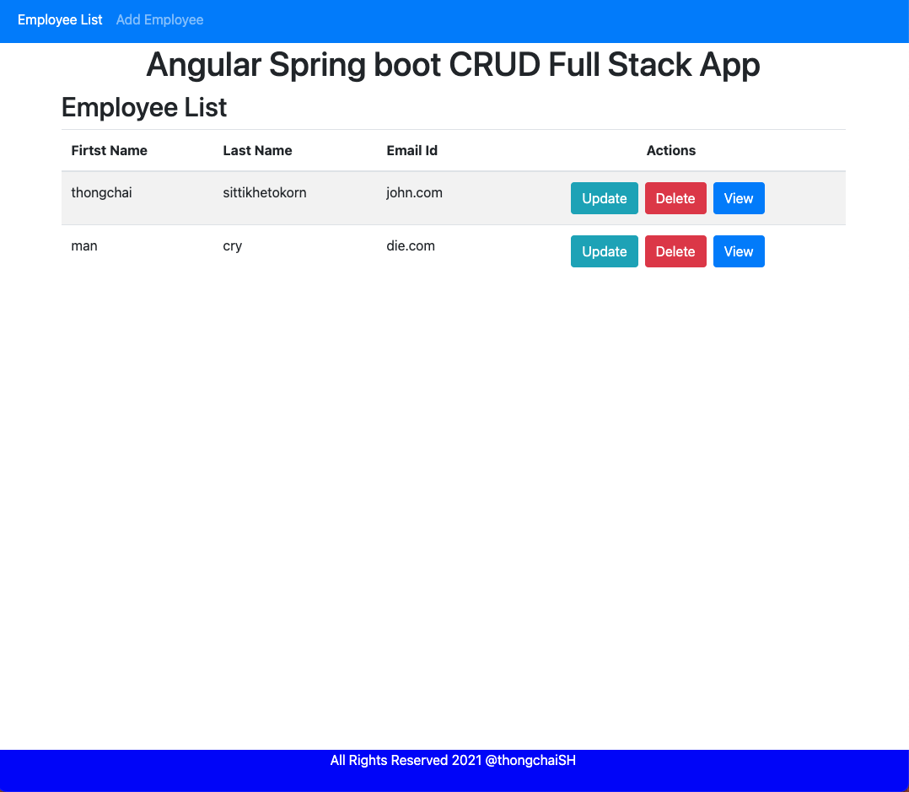

# springboot-angular-full-stack
Spring Boot + Angular Full Stack | Full Course

## Content
Course content:  
Course Content:  
- 0:00 - Course Overview 
- 1:05 - Chapter 1: Project Overview 
- 7:30 - Chapter 2: Project Architecture and Development Process 
- 13:01 - Chapter 3: Creating Spring Boot Project  and MySQL Config
- 19:05 - Chapter 4: Creating JPA Entity and JPA Repository 
- 24:20 - Chapter 5: Creating List Employee REST API 
- 32:22 - Chapter 6: Creating Angular App 
- 41:33 - Chapter 7: Exploring Angular CLI Project Structure
- 47:32 - Chapter 8: Angular App Components Overview
- 51:32 - Chapter 9: Add Bootstrap 4 to Angular App
- 57:14 - Chapter 10: Creating Angular List Employee Component
- 1:11:27 - Chapter 11: Connecting Angular with List Employee REST API 
- 1:24:31 - Chapter 12: Routing and Navigation in Angular App
- 1:39:14 - Chapter 13:  Create Employee REST API
- 1:43:14 - Chapter 14:  Creating Angular Create Employee Component
- 1:48:59 - Chapter 15: Angular Create Employee Form Handling
- 1:58:16 - Chapter 16: Connecting Angular with Add Employee REST API
- 2:07:13 - Chapter 17: Creating Get Employee By Id REST API
- 2:13:26 - Chapter 18: Creating Update Employee REST API
- 2:20:38 - Chapter 19: Creating Angular Update Employee Component
- 2:29:24 - Chapter 20: Connecting Angular with Get Employee By Id REST API
- 2:37:00 - Chapter 21: Connecting Angular with Update Employee REST API
- 2:43:31 - Chapter 22:  Creating Delete Employee REST API
- 2:49:44 - Chapter 23: Connecting Angular with Delete employee REST API
- 2:56:08 - Chapter 24: Creating View Employee Details Functionality
- 3:08:22 - Chapter 25: Demo and source code on GitHub
## Architecture

## Complete

[spring Boot + Angular Full Stack | Full Course 2021](https://www.youtube.com/watch?v=G46fjVzQ7BQ)